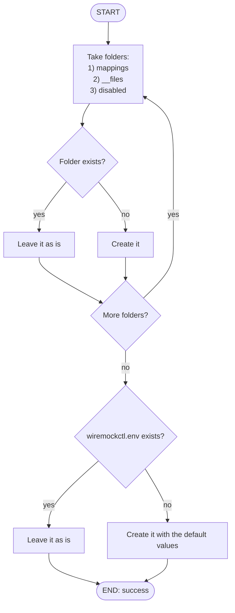

# Command: init

Sets up the folder structure and settings file for a new mock server.

## Workflow Overview

```mermaid
flowchart TD
  start(["START"]) --> while["Take folders:<br>1) mappings<br> 2) __files<br> 3) disabled"]
  while --> exists{"Folder exists?"}
  exists -- no --> create["Create it"]
  exists -- yes --> leave["Leave it as is"]
  leave --> more{"More folders?"}
  create --> more
  more -- yes --> while
  more -- no --> env{"wiremockctl.env exists?"}
  env -- no --> create_env["Create it with the default values"]
  env -- yes --> leave_env["Leave it as is"]
  leave_env --> end1
  create_env --> end1(["END: success"])
```

`init` is safe to run more than once. It only creates what is missing.
