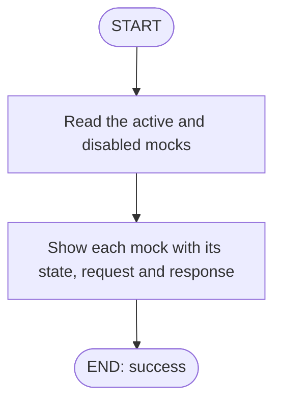

# Command: list

Shows all mocks, active and disabled.

## Workflow Overview

```mermaid
flowchart TD
  start(["START"]) --> read["Read the active and disabled mocks"]
  read --> show["Show each mock with its state, request and response"]
  show --> end1(["END: success"])
```

`list` works while the server is stopped.
