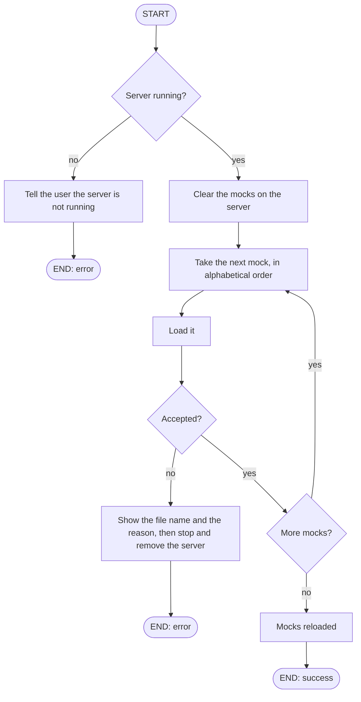

# Command: init

Reloads all mocks on the running server without restarting it.

## Workflow Overview

```mermaid
flowchart TD
  start(["START"]) --> server_up{"Server running?"}
  server_up -- yes --> reset_mocks["Clear the mocks on the server"]
  server_up -- no --> error1["Tell the user the server is not running"]
  error1 --> end1(["END: error"])

  reset_mocks --> load["Take the next mock, in alphabetical order"]
  load --> process["Load it"]
  process --> success{"Accepted?"}
  success -- yes --> more{"More mocks?"}
  success -- no --> error2["Show the file name and the reason, then stop and remove the server"]
  error2 --> end2(["END: error"])

  more -- yes --> load
  more -- no --> done["Mocks reloaded"]
  done --> end3(["END: success"])
```

Use it after you edit, add or remove mock files by hand.
