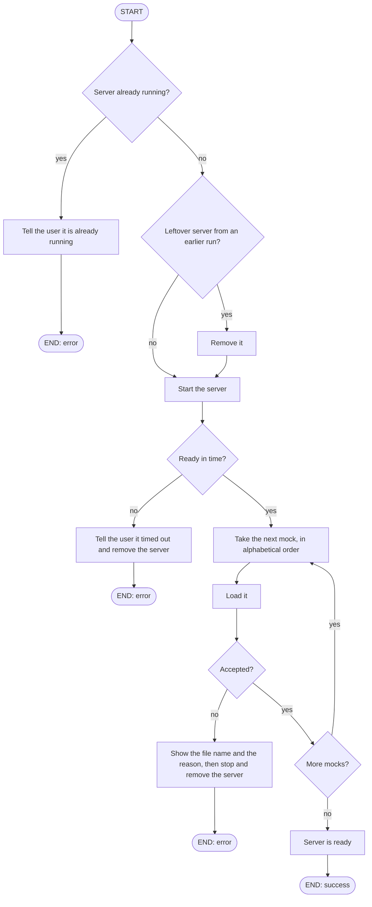

# Command: start

Starts the WireMock server in a Podman container and loads all active mocks.

## Workflow Overview

```mermaid
flowchart TD
  start(["START"]) --> server_up{"Server already running?"}

  server_up -- no --> container_up{"Leftover server from an earlier run?"}
  server_up -- yes --> error1["Tell the user it is already running"]
  error1 --> end1(["END: error"])

  container_up -- no --> run["Start the server"]
  container_up -- yes --> container_rm["Remove it"]
  container_rm --> run

  run --> ready{"Ready in time?"}
  ready -- yes --> load["Take the next mock, in alphabetical order"]
  ready -- no --> error2["Tell the user it timed out and remove the server"]
  error2 --> end2(["END: error"])

  load --> process["Load it"]
  process --> success{"Accepted?"}
  success -- yes --> more{"More mocks?"}
  success -- no --> error3["Show the file name and the reason, then stop and remove the server"]
  error3 --> end3(["END: error"])

  more -- yes --> load
  more -- no --> done["Server is ready"]
  done --> end4(["END: success"])
```
