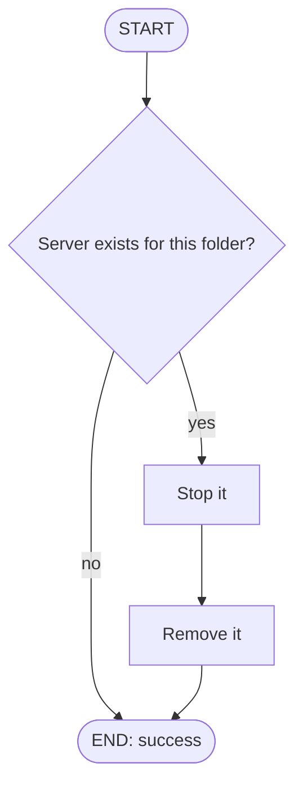

# Command: stop

Stops the WireMock server and removes the Podman container.

## Workflow Overview

```mermaid
flowchart TD
  start(["START"]) --> server_exists{"Server exists for this folder?"}
  server_exists -- no --> end1
  server_exists -- yes --> server_stop["Stop it"]
  server_stop --> server_rm["Remove it"]
  server_rm --> end1(["END: success"])
```
