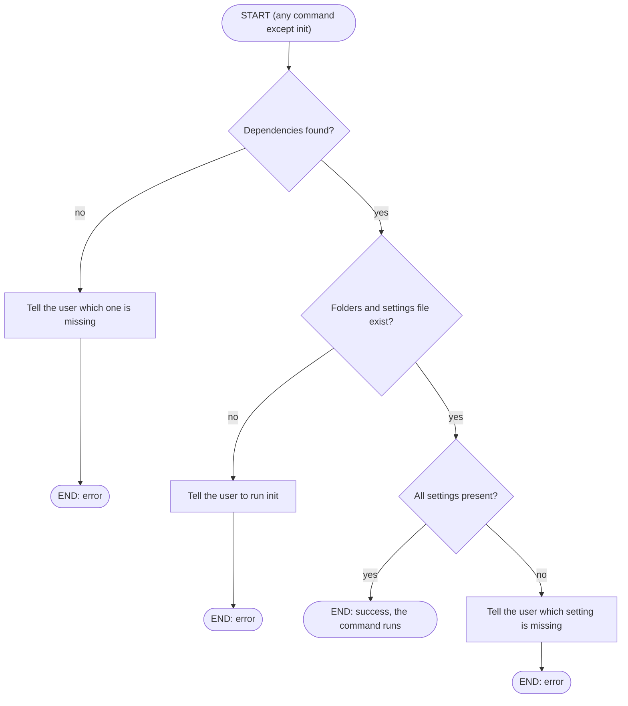

# Preflight checks

Every command except `init` runs these checks first. The first failure stops the script.

## Workflow Overview

```mermaid
flowchart TD
  start(["START (any command except init)"]) --> deps{"Dependencies found?"}
  deps -- yes --> dirs{"Folders and settings file exist?"}
  deps -- no --> error1["Tell the user which one is missing"]
  error1 --> end1(["END: error"])

  dirs -- yes --> config{"All settings present?"}
  dirs -- no --> error2["Tell the user to run init"]
  error2 --> end2(["END: error"])

  config -- yes --> end3(["END: success, the command runs"])
  config -- no --> error3["Tell the user which setting is missing"]
  error3 --> end4(["END: error"])
```
